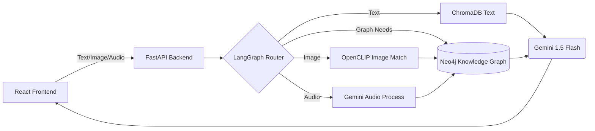

# ⚡ Agentic Pokédex (Multi-Modal Graph RAG)


An Agentic Multi-Modal Graph Retrieval-Augmented Generation (RAG) application built around Generation 1 Pokémon. 
Standard RAG is often "blind" — it relies purely on text but fails at traversing complex relationships or handling visual and audio inputs. This project integrates an LLM (Gemini 1.5 Flash), a Knowledge Graph (Neo4j), and a Vector Database (ChromaDB) to create a multi-modal interactive Pokédex that can "see", "hear", and connect the dots.

## 🌟 Key Features

- **Multi-Modal Querying:** Ask questions using text, identify Pokémon from uploaded images, or use audio files!
- **Graph RAG (Neo4j):** Resolves complex multi-hop queries (e.g., "Who is strong against Charizard?") by traversing explicitly modeled relationships (Types, Weaknesses, Evolutions) rather than relying on textual similarity.
- **Vector Search (ChromaDB):** Uses OpenCLIP embeddings for images and standard embeddings for text to find visually and semantically similar entities.
- **Agentic Routing:** A LangGraph-powered backend automatically parses the user's intent and modalities, delegating the task to the correct agent (Visual Identifier, Graph Traverser, etc.).

## 🏗️ Architectural Design



1. **Frontend:** React + Vite application allowing text chat, file uploads (images), and audio inputs.
2. **Backend:** FastAPI server that acts as the entry point.
3. **Agent Router:** LangGraph determines the processing path based on the provided inputs.
4. **Data Layer:** 
   - **ChromaDB:** Vector store for image and text embeddings.
   - **Neo4j:** Graph database for structural relationships (e.g., `(Pokemon)-[:HAS_TYPE]->(Type)`).

## 🚀 Setup & Installation

### Prerequisites
- Docker and Docker Compose
- Node.js 20+ (for local frontend dev)
- Python 3.11+ and `uv` (for local ingestion script)
- Google Gemini API Key

### 1. Clone & Configure
Clone the repository and set up your environment variables:
```bash
git clone https://github.com/AaryanR1508/agentic-pokedex.git
cd agentic-pokedex

# Copy the example env file
cp .env.example .env
```
Edit `.env` and insert your `GEMINI_API_KEY`.

### 2. Start the Databases
To seed the databases, you first need ChromaDB and Neo4j running. You can spin them up with Docker:
```bash
docker-compose up -d chromadb neo4j
```

### 3. Data Ingestion (One-time setup)
The `ingestion` folder contains Python scripts that pull data from the PokeAPI to seed Neo4j and ChromaDB. You must run this once.
```bash
cd ingestion

# Install dependencies using uv
uv sync

# Run the ingestion scripts
uv run populate.py

cd ..
```

### 4. Start the Application
Run the entire stack (Frontend, Backend, and Databases) using Docker Compose:
```bash
docker-compose up --build -d
```

- **Frontend UI:** [http://localhost:3000](http://localhost:3000)
- **FastAPI Backend / Docs:** [http://localhost:8000/docs](http://localhost:8000/docs)
- **Neo4j Browser:** [http://localhost:7474](http://localhost:7474) (Login: neo4j / password)

## 🎮 Usage Examples
- **Text Query:** "What Pokémon evolve into Raichu?"
- **Complex Graph Query:** "List all Water-type Pokémon that are weak to Electric attacks."
- **Image Upload:** Upload a sprite or drawing of Pikachu. The system uses OpenCLIP to match it against vector embeddings, pulls the corresponding Graph node, and displays the stats and lore!

## 📚 Acknowledgements
- Influenced by the paper **"GraphRAG: Unlocking LLM Discovery on Narrative Private Data" (Edge et al., 2024)**.
- Data provided by [PokéAPI](https://pokeapi.co/).